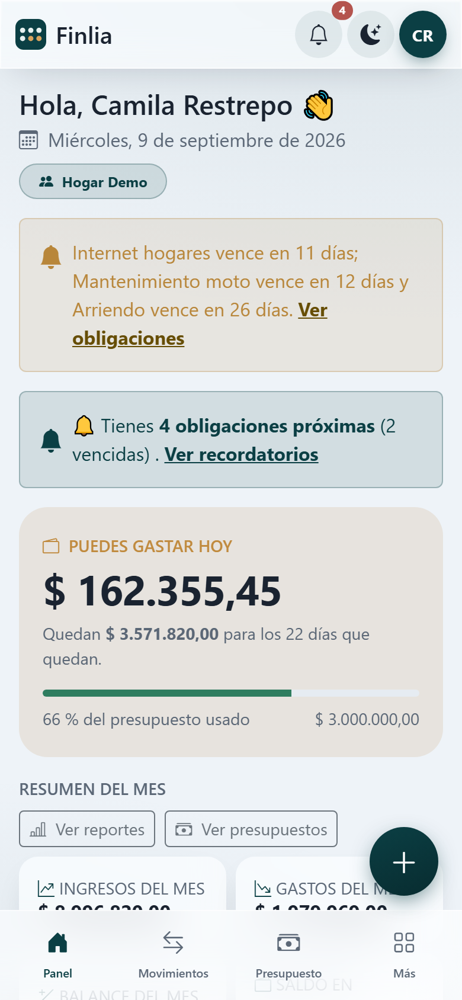
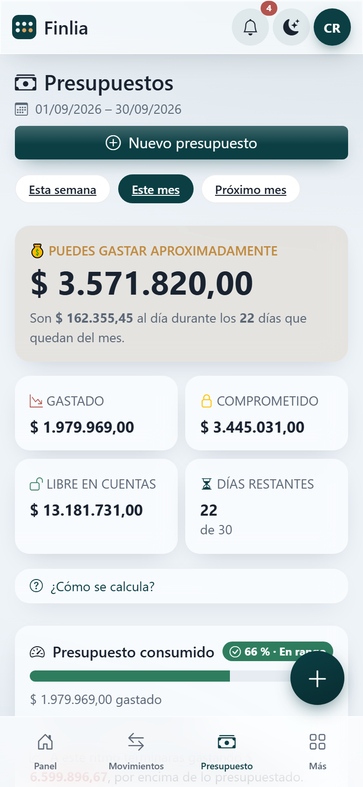
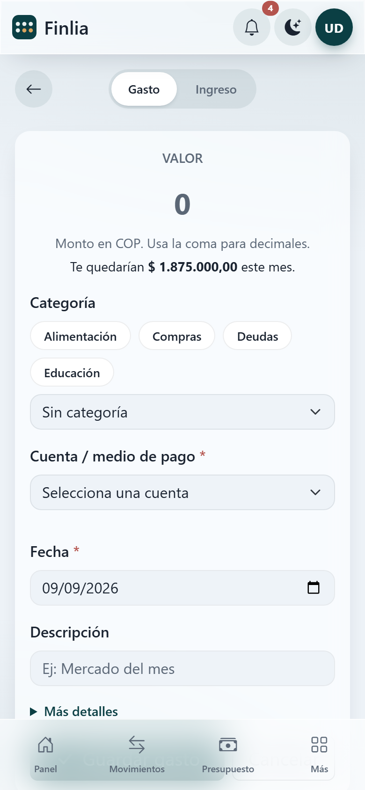
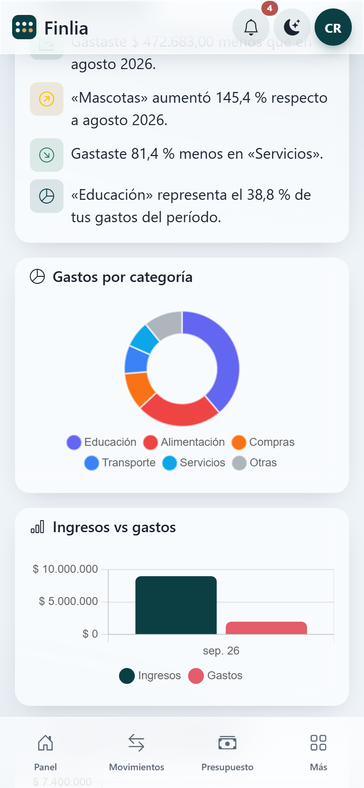
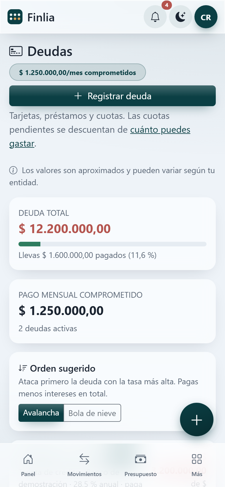
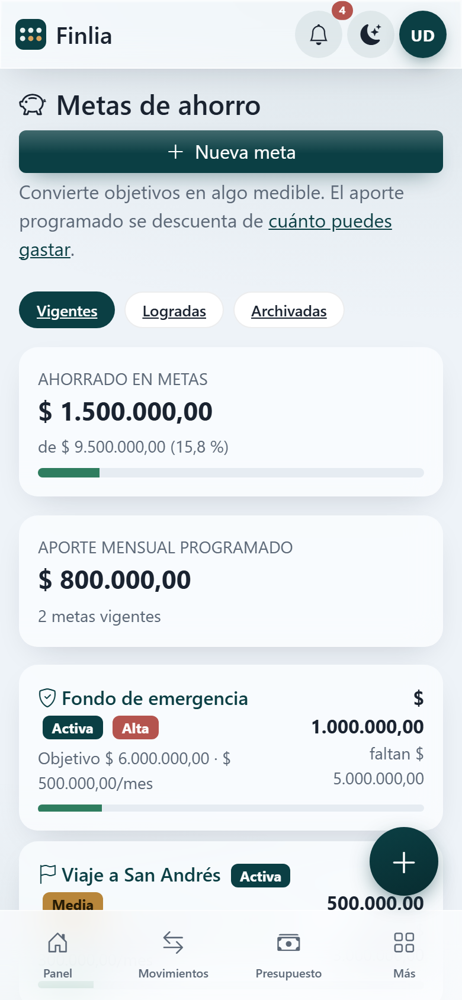

<div align="center">

# 💰 Finlia

**Gestión de finanzas personales y familiares**

*¿Cuánto dinero puedo gastar realmente sin comprometer mis obligaciones?*

**[finlia.online](https://finlia.online)** · [Entrar a la app](https://app.finlia.online)

</div>

---

Finlia es una aplicación web que ayuda a personas y familias a registrar ingresos y gastos, controlar deudas y tarjetas, crear presupuestos y metas de ahorro, y —sobre todo— **calcular cuánto dinero tienen realmente disponible** para gastar. Pensada para usarse a diario desde el celular.

> 🇨🇴 Dirigida inicialmente al mercado colombiano (COP, español). Diseñada para permitir futura expansión a otras monedas y países.

## 🎯 El problema

Las apps de finanzas personales responden bien a *«¿en qué se me fue el dinero?»*. Casi ninguna responde a la pregunta que una familia se hace de verdad el día 12 del mes, con el mercado por hacer y la cuota de la moto pendiente:

> **¿Cuánto puedo gastar hoy sin quedar mal a fin de mes?**

El saldo del banco no lo dice. Ese número no sabe que el arriendo sale el día 5, que el SOAT vence en marzo, ni que hay $800.000 comprometidos en la cuota de la tarjeta. Mirar solo el saldo es exactamente como se llega a fin de mes en rojo habiendo «tenido plata» todo el mes.

## 💡 La solución

Finlia calcula el **dinero realmente disponible** con la plata que ya tienes, no con la que esperas recibir:

```
disponible hasta el cobro = saldo real en cuentas
                          − lo ya apartado en metas de ahorro
                          − gastos fijos y obligaciones que vencen antes del próximo pago
                          − cuotas de deuda que vencen antes del próximo pago
                          − ahorro programado de esos días

puedes gastar hoy = disponible hasta el cobro ÷ días que faltan para el pago
```

El sueldo que aún no llega no suma: el día de cobro solo dice hasta cuándo tiene que alcanzar lo de hoy. Por eso la cifra sirve desde el primer día, sin historial, y no miente si un pago se atrasa. Los ingresos esperados alimentan el **plan** del mes (la proyección del mes siguiente y un tope para que la cifra no se dispare), nunca la aumentan ([ADR-0040](docs/DECISIONS.md#adr-0040)).

Ese cálculo vive en un único servicio de dominio (`BudgetCalculatorService`) y es la cifra que la app pone en primer plano: **«Puedes gastar hoy $81.521»**, no «tu saldo es $19.992.420».

## 📸 Capturas

Datos de demostración generados con Faker (`es_CO`). El repositorio nunca contiene datos financieros reales.

| Panel | Dinero disponible | Registrar gasto |
|---|---|---|
|  |  |  |
| **Reportes** | **Deudas** | **Metas de ahorro** |
|  |  |  |

> Se regeneran con la app corriendo y sembrada. La clave es la del usuario demo
> de más abajo; va por entorno para no dejarla escrita en el repositorio:
>
> ```bash
> SHOTS_PASSWORD=finlia123 npm run screenshots
> ```

## 🙋 Why this project?

Finlia no nació de un tutorial ni de un ejercicio: nació de un problema real de administración financiera de un hogar colombiano. Llevar las cuentas en una hoja de cálculo respondía qué había pasado, pero nunca qué se podía hacer hoy — y esa es la decisión que uno toma a diario, no una vez al mes.

Eso condicionó cada decisión técnica del proyecto:

- **Mobile-first de verdad**, no un escritorio encogido: el gasto se registra en la fila de la caja, en menos de cinco segundos, con el pulgar.
- **Multi-hogar desde el diseño**, porque las finanzas de una familia son de dos personas, no de una cuenta compartida por contraseña. El aislamiento entre hogares es la amenaza #1 del proyecto y tiene su propio barrido de tests.
- **Hosting compartido como restricción**, no como accidente: nada de colas persistentes, Redis ni Docker. Todo lo periódico entra por una única línea de cron.
- **Las estimaciones se marcan como estimaciones.** La proyección de fin de deuda dice que es aproximada, porque presentar un cálculo propio como si fuera el estado de cuenta del banco es cómo se pierde la confianza del usuario.

Las decisiones que no eran obvias están escritas y fechadas en [docs/DECISIONS.md](docs/DECISIONS.md) — 37 ADR con contexto, alternativas descartadas y consecuencias.

## ✨ Funcionalidades (roadmap)

- Registro rápido de ingresos y gastos (mobile-first)
- Cuentas, medios de pago y tarjetas de crédito
- Categorización de movimientos
- Presupuestos por categoría y cálculo de **dinero disponible**
- Gastos recurrentes y obligaciones futuras (SOAT, seguros, matrículas…)
- Deudas y tarjetas de crédito
- Metas de ahorro (con fondo de emergencia)
- Dashboard y reportes con gráficos
- Recordatorios de pagos próximos
- Hogares compartidos con roles e invitaciones

El estado detallado de cada funcionalidad está en [docs/ROADMAP.md](docs/ROADMAP.md).

## 🧱 Stack

- **Laravel 13.8** · **PHP 8.4**
- **MySQL/MariaDB o PostgreSQL** (SQLite para tests) — ambos soportados, [ADR-0036](docs/DECISIONS.md#adr-0036)
- **Blade** · **Bootstrap 5** · **JavaScript vanilla** · **Chart.js**
- **Eloquent** · Migrations · Seeders · Factories
- **PHPUnit**
- Despliegue: **Hostinger** (hosting compartido)
- UI mobile-first propia sobre Bootstrap 5 (glass, chips, barra inferior + FAB) — ver [docs/UI_DESIGN.md](docs/UI_DESIGN.md)

## 🚀 Instalación local

```bash
git clone https://github.com/ronaldo-duran/Finlia.git
cd Finlia
composer install
cp .env.example .env
php artisan key:generate
```

Configura la base de datos en `.env`. Finlia soporta **MySQL/MariaDB y PostgreSQL** ([ADR-0036](docs/DECISIONS.md#adr-0036)); elige uno (ver [docs/DEPLOYMENT.md](docs/DEPLOYMENT.md) para los valores exactos y la configuración de Colombia):

```env
APP_NAME=Finlia
APP_TIMEZONE=America/Bogota
APP_LOCALE=es
APP_FAKER_LOCALE=es_CO

# MySQL / MariaDB
DB_CONNECTION=mysql
DB_HOST=127.0.0.1
DB_PORT=3306
DB_DATABASE=finlia
DB_USERNAME=tu_usuario
DB_PASSWORD=tu_password

# …o PostgreSQL: basta cambiar el driver y el puerto
# DB_CONNECTION=pgsql
# DB_PORT=5432
```

Luego:

```bash
php artisan migrate --seed
npm install
npm run build
php artisan serve
```

Abre `http://localhost:8000`.

> 🔑 **Usuario de demostración** (creado por el seeder con datos falsos):
> correo `demo@finlia.test` · contraseña `finlia123`.

### Seeders

`--seed` ejecuta `DatabaseSeeder`, que deja la app usable de inmediato:

| Seeder | Qué crea |
|---|---|
| `CategorySeeder` | Categorías por defecto de ingreso y gasto del hogar |
| `TermsVersionSeeder` | Versión vigente de los términos (sin ella el login rebota a aceptarlos) |
| `DatabaseSeeder` | Usuario demo, su hogar y movimientos, deudas y metas de ejemplo |

Todos los datos son **falsos**, generados con Faker (`es_CO`). El repositorio
nunca contiene datos financieros reales de nadie.

Para rehacer la base desde cero: `php artisan migrate:fresh --seed`.

## 🧪 Tests

```bash
composer test          # PHPUnit con SQLite en memoria
php artisan test --filter=HouseholdTest
```

### Calidad y E2E

```bash
vendor/bin/pint                  # linter/formatter PHP (en CI: pint --test)
npm run test:e2e                 # Playwright (Chromium) contra Laravel + SQLite + seed
npm run test:e2e:ui              # ídem, con inspector visual
```

Los E2E levantan su propio servidor (`php artisan serve` en el puerto 8890) con una
BD SQLite aislada (`database/playwright.sqlite`) y el seeder de datos falsos; no
tocan tu `.env` ni tu base local. Se necesita `npx playwright install chromium` la
primera vez.

### CI (GitHub Actions)

En cada push/PR corre [.github/workflows/ci.yml](.github/workflows/ci.yml) con cuatro
jobs: **PHP** (Pint + PHPUnit sobre SQLite), **BD** (la misma suite contra MySQL 8 y
PostgreSQL 16, en matriz), **Assets** (build de Vite) y **E2E** (Playwright con
Chromium, sube el reporte como artefacto si falla).

El job de **BD** existe porque SQLite perdona SQL que los motores de producción
rechazan: es lo que impide que una función específica de un motor llegue a
producción sin que ningún test se entere.

## 📦 Despliegue

Finlia corre en **Hostinger** (hosting compartido) sobre dos dominios: `finlia.online` sirve el sitio público y `app.finlia.online` la aplicación ([ADR-0038](docs/DECISIONS.md#adr-0038)).

Hostinger **no tiene Node ni Composer**, así que el artefacto desplegable —código + `vendor/` + `public/build`— se construye en GitHub Actions al publicar un tag `v*` y se publica en un repositorio aparte del que el servidor solo hace *pull*:

```bash
# En el servidor, tras cada despliegue publicado
git fetch origin && git reset --hard origin/main
php artisan migrate --force
php artisan config:cache && php artisan route:cache && php artisan view:cache
```

El detalle está en [docs/DEPLOYMENT.md](docs/DEPLOYMENT.md).

El *document root* del dominio debe apuntar a `public/`, para que `.env`, `storage/` y `app/` queden fuera de la web.

### ⏱️ Cron

Hosting compartido no admite procesos permanentes: **todo lo periódico entra por el Scheduler**, con una sola entrada de cron (Hostinger → *Advanced → Cron Jobs*):

```cron
* * * * * cd /home/uXXXX/domains/tudominio/finlia && /usr/local/bin/php artisan schedule:run >> /dev/null 2>&1
```

Esa única línea dispara todas las tareas programadas (`routes/console.php`):

| Tarea | Cuándo | Para qué |
|---|---|---|
| `finlia:process-export-requests` | 02:00 | Genera el ZIP de datos del hogar y lo envía por correo (hora valle) |
| `finlia:purge-pending-deletions` | 05:30 | Borra definitivamente las cuentas cuyo plazo de 30 días venció |
| `finlia:generate-recurring-payments` | 06:00 | Materializa los gastos recurrentes que tocan hoy |
| `finlia:send-reminder-digests` | 06:30 | Resumen diario de obligaciones por correo |

Comprueba que está bien con `php artisan schedule:list`.

## 🛠️ Troubleshooting

| Síntoma | Causa habitual | Solución |
|---|---|---|
| `419 Page Expired` al enviar un formulario | Falta `@csrf`, o la sesión caducó | Añade `@csrf` al formulario. `CsrfTokenSweepTest` detecta el caso — la suite no lo pilla sola porque Laravel desactiva CSRF en tests |
| `500` tras desplegar, con la web en blanco | Caché de config apuntando a valores viejos | `php artisan config:clear` y vuelve a cachear |
| Los estilos no cargan en producción | Falta `public/build` (está en `.gitignore`) | `npm ci && npm run build` y sube la carpeta |
| `SQLSTATE[HY000] [1045]` (MySQL) o `password authentication failed` (PostgreSQL) al migrar | Credenciales de BD incorrectas en `.env` | Revisa `DB_USERNAME` / `DB_PASSWORD` |
| `SQLSTATE[42601] syntax error` con una función de fecha | SQL específico de un motor usado contra otro | Toda función propia del motor va en un `match` sobre el driver ([ADR-0036](docs/DECISIONS.md#adr-0036)); el job **BD** del CI lo detecta |
| El login rebota siempre a «aceptar términos» | Falta la versión vigente de términos | `php artisan db:seed --class=TermsVersionSeeder` |
| Las invitaciones no llegan por correo | `MAIL_MAILER=log` (no entrega a bandejas) | Configura SMTP; mientras tanto la app ofrece el enlace manual |
| Las tareas programadas no corren | El cron de `schedule:run` no está puesto | Añade la línea de la sección anterior |
| `Permission denied` en `storage/` | Permisos tras subir por FTP | `chmod -R 775 storage bootstrap/cache` |

## 🔒 Seguridad

Este proyecto maneja **información financiera sensible** y es un repositorio **público**. La política de seguridad completa está en [docs/SECURITY.md](docs/SECURITY.md). Lo esencial:

- Aislamiento estricto por hogar (multi-tenant).
- `DECIMAL` para dinero (nunca `FLOAT`).
- Policies + Form Requests en cada operación.
- Nunca se commitean `.env`, credenciales ni datos reales.

Para reportar una vulnerabilidad, abre un issue privado o contacta al maintainer. **No abras un issue público** con detalles explotables.

## 🧰 Tecnologías demostradas

Qué se resolvió con cada pieza, no solo qué se usó:

| Tecnología | Dónde se ve en este repositorio |
|---|---|
| **Laravel 13 · PHP 8.3** | 22 modelos, 24 enums y 14 servicios de dominio con tipado estricto; middleware propio para términos y cuentas suspendidas |
| **Arquitectura por capas** | Controladores finos → servicios → Eloquent. Ningún cálculo financiero vive en un controlador o una vista ([ADR-0010](docs/DECISIONS.md#adr-0010)) |
| **MySQL · PostgreSQL · SQLite** | La misma suite corre contra los tres. El SQL propio de un motor se resuelve con un `match` sobre el driver ([ADR-0036](docs/DECISIONS.md#adr-0036)) |
| **Modelado de datos** | `DECIMAL(15,2)` para todo el dinero, FKs con `onDelete` explícito, índices compuestos por `(household_id, …)` |
| **Seguridad multi-tenant** | Aislamiento por hogar con policies + consultas acotadas, y un barrido que intenta el acceso cruzado sobre **cada** ruta |
| **Autenticación y privacidad** | Verificación de correo, cambio de correo en dos pasos, términos versionados con prueba de consentimiento, eliminación de cuenta con plazo y exportación de datos en ZIP |
| **Blade · Bootstrap 5** | Sistema de diseño propio (glass, chips, barra inferior, FAB) documentado en [docs/UI_DESIGN.md](docs/UI_DESIGN.md) |
| **JavaScript vanilla · Chart.js** | Cinco gráficos, simulador de deuda en el navegador que replica el servicio PHP, e indicadores de carga. Sin framework de frontend |
| **PWA** | Manifest, service worker e instalación en iOS y Android |
| **Testing** | 559 tests PHPUnit + 37 E2E con Playwright. Barridos que fijan invariantes: aislamiento entre hogares, CSRF y N+1 |
| **CI/CD** | GitHub Actions con matriz de motores de base de datos, linter, build de assets y E2E con reporte como artefacto |
| **Despliegue en hosting compartido** | Sin procesos permanentes: cuatro tareas programadas tras una sola línea de cron; cabeceras de seguridad y HTTPS en `.htaccess` |

## 📚 Documentación

- [CLAUDE.md](CLAUDE.md) — Manual operativo para IA
- [AGENTS.md](AGENTS.md) — Reglas de agentes
- [docs/ARCHITECTURE.md](docs/ARCHITECTURE.md) — Arquitectura
- [docs/DATA_MODEL.md](docs/DATA_MODEL.md) — Modelo de datos
- [docs/SECURITY.md](docs/SECURITY.md) — Seguridad
- [docs/DEPLOYMENT.md](docs/DEPLOYMENT.md) — Despliegue
- [docs/ROADMAP.md](docs/ROADMAP.md) — Roadmap de épicas
- [docs/CONVENTIONS.md](docs/CONVENTIONS.md) — Convenciones
- [docs/UI_DESIGN.md](docs/UI_DESIGN.md) — Sistema de diseño (UI mobile-first)
- [docs/BRAND.md](docs/BRAND.md) — Identidad de marca (símbolo, logo, paleta)
- [docs/DECISIONS.md](docs/DECISIONS.md) — Decisiones (ADR)
- `scrum/epics/` — Detalle de las épicas aún abiertas (las completadas se liberaron en la v0.34.1; su histórico está en [CHANGELOG.md](CHANGELOG.md))

## 📄 Licencia

**GNU Affero General Public License v3.0 o posterior** (AGPL-3.0-or-later). El texto completo está en [LICENSE](LICENSE).

```
Copyright (C) 2026 Ronaldo Duran

Este programa es software libre: puedes redistribuirlo y/o modificarlo bajo
los términos de la GNU Affero General Public License publicada por la Free
Software Foundation, en su versión 3 o (a tu elección) cualquier versión
posterior.

Se distribuye con la esperanza de que sea útil, pero SIN NINGUNA GARANTÍA;
ni siquiera la garantía implícita de COMERCIABILIDAD o IDONEIDAD PARA UN
PROPÓSITO PARTICULAR. Consulta la GNU Affero General Public License para
más detalles.
```

### Qué implica en la práctica

- Puedes usar, estudiar, modificar y redistribuir Finlia libremente.
- Si **ofreces Finlia como servicio en red** —modificado o no—, la AGPL (§13) obliga a poner el código fuente correspondiente a disposición de quienes lo usan. Es la diferencia con la GPL normal, y la razón de elegirla: cierra el hueco de tomar el proyecto, montarlo como SaaS cerrado y no devolver nada.
- El trabajo derivado debe distribuirse también bajo AGPL.

> **Sobre versiones anteriores:** Finlia se publicó bajo licencia MIT hasta la
> versión 0.28.0. Ese código sigue disponible bajo MIT para quien lo obtuviera
> entonces — una relicencia no es retroactiva. El cambio aplica de esta versión
> en adelante.
