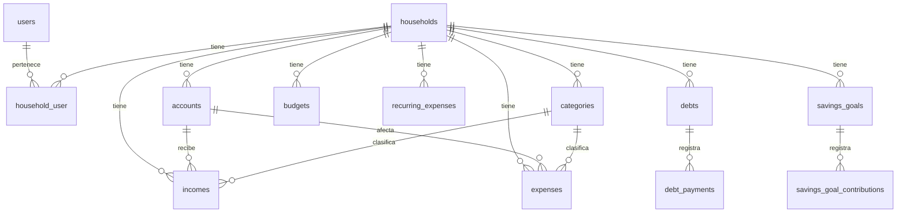

# Modelo de Datos — Finlia

> Mapa de entidades por épica. **Guía de diseño**, no esquema congelado: cada épica detalla su migración. Las decisiones abiertas están marcadas ⚖️ (ver [DECISIONS.md](DECISIONS.md)).

## Convenciones generales

- **Todas las tablas** financieras llevan `household_id` (FK → `households.id`) con index. Es la base del multi-tenancy.
- **Auditoría**: `id` (bigIncrements), `created_at`, `updated_at`. Borrado lógico con `deleted_at` solo donde tenga sentido (movimientos, deudas).
- **FKs**: `<tabla_singular>_id`. Index en cada FK. `onDelete` coherente (normalmente `cascade` para hijos de un hogar, `restrict` para relaciones críticas).
- **Dinero**: `DECIMAL(15,2)` **siempre**.
- **Fechas**: `date` o `dateTime`. Mostrar al usuario como DD/MM/AAAA.
- **Enums**: preferir columnas tipo string con validación por Enum PHP (`App\Enums\*`) antes que `enum` de MySQL (portabilidad).
- **Tablas pivot**: nombre en orden alfabético (`household_user`).

---

## Épica 1 — Fundación

### `users` *(existe, revisar campos en Épica 1)*
| Campo | Tipo | Notas |
|---|---|---|
| id | bigint, pk | |
| name | string | |
| email | string, unique | |
| email_verified_at | timestamp, null | |
| password | string (hash) | |
| remember_token | string | |
| preferred_currency | string, null | default COP; multi-moneda futuro |
| locale | string, null | default 'es' |
| timezone | string, null | default 'America/Bogota' |
| timestamps | | |

---

## Épica 2 — Hogares, familias y miembros

> 🟢 **Implementado** (Épica 2). Hogar activo en sesión (`session('household_id')`) resuelto por helper `active_household()` (ver [ADR-0011](DECISIONS.md#adr-0011)). Tokens de invitación hasheados sha256 (ver [ADR-0003](DECISIONS.md#adr-0003)).

### `households`
| Campo | Tipo | Notas |
|---|---|---|
| id | bigint, pk | |
| name | string | "Ronaldo & Vanessa" |
| owner_id | bigint, FK→users | creador/admin |
| currency | string | default 'COP' |
| timezone | string | default 'America/Bogota' |
| timestamps, softDeletes | | |

### `household_user` *(pivot: miembros del hogar)*
| Campo | Tipo | Notas |
|---|---|---|
| household_id | FK | |
| user_id | FK | |
| role | string | enum: `owner`, `member` (→ `App\Enums\HouseholdRole`) |
| joined_at | timestamp | |
| timestamps | | |

- Un usuario puede pertenecer a varios hogares (la spec lo permite si no complica). El hogar **activo** se guarda en sesión.

### `household_invitations`
| Campo | Tipo | Notas |
|---|---|---|
| id | bigint, pk | |
| household_id | FK | |
| email | string | invitado |
| token | string(64), unique, index | **hash** del token público |
| role | string | rol que tendrá al aceptar |
| status | string | `pending`, `accepted`, `expired`, `revoked` |
| expires_at | timestamp | |
| accepted_at | timestamp, null | |
| accepted_by_user_id | FK→users, null | |
| timestamps | | |

- El token se genera aleatorio (64 chars), se guarda **hasheado** y se envía el plano al enlace.

---

## Épica 3 — Cuentas, ingresos y gastos

### `accounts`
| Campo | Tipo | Notas |
|---|---|---|
| id, household_id | | |
| name | string | "Davivienda ahorros" |
| type | string | enum `AccountType`: cash, bank, savings, digital_wallet, credit_card, other |
| initial_balance | decimal(15,2) | saldo inicial |
| current_balance | decimal(15,2) | recalculable; ⚖️ decidir si se persiste o se calcula |
| currency | string | default COP |
| is_active | boolean | |
| notes | text, null | |
| timestamps | | |

### `categories`
| Campo | Tipo | Notas |
|---|---|---|
| id, household_id | | `household_id` null = categoría global (seed) |
| name | string | |
| type | string | enum: `income`, `expense` (→ `CategoryType`) |
| parent_id | FK→categories, null | subcategorías opcional |
| color | string, null | para gráficos |
| icon | string, null | |
| is_default | boolean | true para las del seed global |
| timestamps | | |

- Seed con: Alimentación, Vivienda, Transporte, Salud, Mascotas, Entretenimiento, Educación, Deudas, Servicios, Compras, Otros (más algunas de ingreso: Salario, Freelance, Otros ingresos).

### `incomes` (ADR-0001 — tablas separadas, ACEPTADA)
| Campo | Tipo | Notas |
|---|---|---|
| id, household_id | | |
| user_id | FK | quién lo registró |
| account_id | FK | cuenta afectada |
| category_id | FK, null | categoría (de tipo income) |
| amount | decimal(15,2) | siempre positivo |
| date | date | fecha del ingreso |
| description | string, null | |
| notes | text, null | |
| source | string, null | origen: salario, freelance, etc. |
| timestamps, softDeletes | | |

### `expenses` (ADR-0001 — tablas separadas, ACEPTADA)
| Campo | Tipo | Notas |
|---|---|---|
| id, household_id | | |
| user_id | FK | quién lo registró |
| account_id | FK | cuenta/medio de pago afectado |
| category_id | FK, null | categoría (de tipo expense) |
| amount | decimal(15,2) | siempre positivo |
| date | date | fecha del gasto |
| description | string, null | |
| notes | text, null | |
| payment_method | string, null | efectivo, tarjeta, transferencia… |
| timestamps, softDeletes | | |

> **ADR-0001 (ACEPTADA)**: ingresos y gastos viven en tablas separadas (`incomes` + `expenses`), cada una con su modelo (`Income`/`Expense`), factory y Policy. Las agregaciones que combinan ambos (dashboard, presupuestos) se centralizan en un `MovementSummaryService` para no duplicar lógica. Las **transferencias** entre cuentas (Épica 10) no son ni ingreso ni gasto: se resolverán con una tabla `transfers` dedicada (decisión diferida a Épica 10); no se mezclan aquí.

---

## Épica 4 — Presupuestos y dinero disponible

### `budgets`
| Campo | Tipo | Notas |
|---|---|---|
| id, household_id | | |
| category_id | FK, null | null = presupuesto total |
| amount | decimal(15,2) | |
| period | string | enum: `monthly` (inicial) → `weekly`, `yearly` futuro |
| year | smallint | |
| month | tinyint (1-12) | |
| timestamps | | |

### Servicio: `App\Services\AvailableMoneyService` / `BudgetCalculatorService`
No es tabla. Calcula:
```
dineroDisponible = ingresosEsperados
                 − gastosFijos
                 − gastosRecurrentesPróximos
                 − obligacionesDeuda
                 − ahorroProgramado
                 − presupuestoComprometido
```
Separar conceptos: **balance actual · disponible · comprometido · libre**.

---

## Épica 5 — Gastos recurrentes y obligaciones futuras

### `recurring_expenses`
| Campo | Tipo | Notas |
|---|---|---|
| id, household_id | | |
| name | string | "SOAT", "Arriendo" |
| amount | decimal(15,2) | estimado |
| frequency | string | enum `Frequency`: weekly, biweekly, monthly, quarterly, semester, yearly, custom |
| frequency_interval | int, null | cada N (para custom) |
| next_date | date | próxima fecha |
| category_id | FK, null | |
| account_id | FK, null | |
| is_active | boolean | |
| auto_generate | boolean | si genera gasto automáticamente (opcional) |
| notes | text, null | |
| timestamps | | |

---

## Épica 6 — Deudas y tarjetas de crédito

### `debts`
| Campo | Tipo | Notas |
|---|---|---|
| id, household_id | | |
| name | string | "Tarjeta Davivienda", "Préstamo coche" |
| institution | string, null | |
| type | string | enum `DebtType`: credit_card, loan, vehicle, family, other |
| original_amount | decimal(15,2) | |
| current_balance | decimal(15,2) | |
| interest_rate | decimal(6,3), null | % anual |
| interest_rate_type | string, null | fixed, variable |
| minimum_payment | decimal(15,2), null | |
| scheduled_payment | decimal(15,2), null | cuota pactada |
| due_day | tinyint, null | día de pago mensual |
| start_date | date, null | |
| end_date | date, null | |
| status | string | active, refinanced, paid, written_off |
| notes | text, null | |
| timestamps | | |

### `debt_payments`
| Campo | Tipo | Notas |
|---|---|---|
| id, debt_id | FK (cascade) | |
| household_id | | denormalizado para aislamiento/queries |
| amount | decimal(15,2) | |
| date | date | |
| type | string | minimum, scheduled, extra |
| notes | text, null | |
| timestamps | | |

### `credit_cards` ⚖️ ADR-0002
Dos opciones:
- **(a)** `accounts` con `type=credit_card` + tabla `credit_cards(account_id, credit_limit, available_credit, statement_date, payment_due_date, annual_fee, monthly_fee)`.
- **(b)** Tabla `credit_cards` independiente.

*Recomendación: opción (a)* — la tarjeta es una cuenta con atributos extra; evita duplicar saldos. Pendiente confirmación.

> **Seguridad**: nunca almacenar número completo de tarjeta, CVV, PIN. Solo últimos 4 dígitos si se quiere.

### `debt_refinancings` (opcional, Épica 6)
Historial de refinanciación: debt_id, interest_rate, term, installment, start_date, refinanced_balance.

---

## Épica 7 — Metas de ahorro

### `savings_goals`
| Campo | Tipo | Notas |
|---|---|---|
| id, household_id | | |
| name | string | "Fondo de emergencia" |
| target_amount | decimal(15,2) | |
| current_amount | decimal(15,2) | |
| target_date | date, null | |
| priority | string, null | low, medium, high |
| status | string | active, paused, completed, archived |
| is_emergency_fund | boolean | la marca para cálculos futuros |
| notes | text, null | |
| timestamps | | |

### `savings_goal_contributions`
| Campo | Tipo | Notas |
|---|---|---|
| id, savings_goal_id | FK (cascade) | |
| household_id | | |
| amount | decimal(15,2) | positivo aporte, negativo retiro (o `type`) |
| type | string | deposit, withdrawal |
| date | date | |
| notes | text, null | |
| timestamps | | |

---

## Épica 8 — Dashboard y reportes
Sin tablas nuevas de dominio. Posible `report_exports` (log de exportaciones) si se requiere auditoría. Vistas y queries de agregación.

---

## Épica 9 — Recordatorios y notificaciones

### `reminders`
| Campo | Tipo | Notas |
|---|---|---|
| id, household_id | | |
| user_id | FK, null | a quién va dirigido |
| source_type | string | morph: recurring_expense, debt, savings_goal, custom |
| source_id | bigint, null | |
| title | string | |
| due_date | date | |
| status | string | pending, upcoming, overdue, completed |
| scheduled_at | timestamp | cuándo notificar |
| timestamps | | |

- O usar la tabla `notifications` de Laravel para in-app. Decidir en Épica 9.

---

## Épica 12 — Monetización (SaaS)

### `plans`
| Campo | Tipo | Notas |
|---|---|---|
| id | | |
| name | string | free, premium |
| slug | string, unique | |
| price_monthly | decimal(15,2) | |
| price_yearly | decimal(15,2) | |
| features | json | mapa feature→bool |
| limits | json | mapa límite→int (max_households, max_members, …) |
| is_active | boolean | |
| timestamps | | |

### `subscriptions`
| Campo | Tipo | Notas |
|---|---|---|
| id, household_id | | |
| plan_id | FK | |
| status | string | active, canceled, past_due, trialing |
| started_at | timestamp | |
| ends_at | timestamp, null | |
| timestamps | | |

> La verificación de límites/features **siempre en backend** (ver [SECURITY.md](SECURITY.md)).

---

## Mapa de relaciones (simplificado)



## Índices recomendados

- Todas las `household_id` (FK + index).
- `incomes(household_id, date)` y `expenses(household_id, date)` — compuestos, alimentan el dashboard.
- `incomes(household_id, category_id)` y `expenses(household_id, category_id)`.
- `household_invitations(token)` unique index.
- `reminders(household_id, status, due_date)`.
