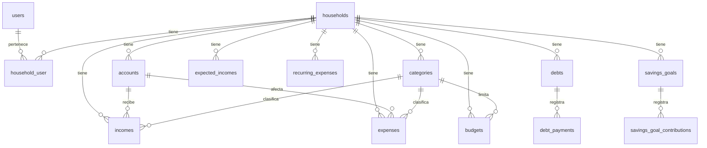

# Modelo de Datos — Finlia

> Mapa de entidades por épica. **Guía de diseño**, no esquema congelado: cada épica detalla su migración. Las decisiones abiertas están marcadas ⚖️ (ver [DECISIONS.md](DECISIONS.md)).

## Convenciones generales

- **Todas las tablas** financieras llevan `household_id` (FK → `households.id`) con index. Es la base del multi-tenancy.
- **Auditoría**: `id` (bigIncrements), `created_at`, `updated_at`. Borrado lógico con `deleted_at` solo donde tenga sentido (movimientos, deudas).
- **FKs**: `<tabla_singular>_id`. Index en cada FK. `onDelete` coherente (normalmente `cascade` para hijos de un hogar, `restrict` para relaciones críticas).
- **Dinero**: `DECIMAL(15,2)` **siempre**.
- **Fechas**: `date` o `dateTime`. Mostrar al usuario como DD/MM/AAAA.
- **Enums**: preferir columnas tipo string con validación por Enum PHP (`App\Enums\*`) antes que `enum` de MySQL (portabilidad).
- **Tablas pivot**: nombre en orden alfabético (`household_user`).

---

## Épica 1 — Fundación

### `users` *(existe, revisar campos en Épica 1)*
| Campo | Tipo | Notas |
|---|---|---|
| id | bigint, pk | |
| name | string | |
| email | string, unique | |
| email_verified_at | timestamp, null | |
| password | string (hash) | |
| remember_token | string | |
| preferred_currency | string, null | default COP; multi-moneda futuro |
| locale | string, null | default 'es' |
| timezone | string, null | default 'America/Bogota' |
| timestamps | | |

---

## Épica 2 — Hogares, familias y miembros

> 🟢 **Implementado** (Épica 2). Hogar activo en sesión (`session('household_id')`) resuelto por helper `active_household()` (ver [ADR-0011](DECISIONS.md#adr-0011)). Tokens de invitación hasheados sha256 (ver [ADR-0003](DECISIONS.md#adr-0003)).

### `households`
| Campo | Tipo | Notas |
|---|---|---|
| id | bigint, pk | |
| name | string | "Ronaldo & Vanessa" |
| owner_id | bigint, FK→users | creador/admin |
| currency | string | default 'COP' |
| timezone | string | default 'America/Bogota' |
| timestamps, softDeletes | | |

### `household_user` *(pivot: miembros del hogar)*
| Campo | Tipo | Notas |
|---|---|---|
| household_id | FK | |
| user_id | FK | |
| role | string | enum: `owner`, `member` (→ `App\Enums\HouseholdRole`) |
| joined_at | timestamp | |
| reminders_email | boolean, `false` | Épica 9: opt-in del digest diario ([ADR-0028](DECISIONS.md#adr-0028)) |
| last_reminder_digest_at | timestamp, null | idempotencia: "ya recibió el correo de hoy" |
| timestamps | | |

- Un usuario puede pertenecer a varios hogares (la spec lo permite si no complica). El hogar **activo** se guarda en sesión.
- Las preferencias de correo son **por miembro y por hogar** (viven en el pivote): cada quien decide en qué hogar quiere el digest.

### `household_invitations`
| Campo | Tipo | Notas |
|---|---|---|
| id | bigint, pk | |
| household_id | FK | |
| email | string | invitado |
| token | string(64), unique, index | **hash** del token público |
| role | string | rol que tendrá al aceptar |
| status | string | `pending`, `accepted`, `expired`, `revoked` |
| expires_at | timestamp | |
| accepted_at | timestamp, null | |
| accepted_by_user_id | FK→users, null | |
| timestamps | | |

- El token se genera aleatorio (64 chars), se guarda **hasheado** y se envía el plano al enlace.

---

## Épica 3 — Cuentas, ingresos y gastos

> 🟢 **Implementado** (Épica 3). `current_balance` se persiste y **recomputa** desde `initial_balance + Σincomes − Σexpenses` en cada escritura de movimiento (ver [ADR-0012](DECISIONS.md#adr-0012)).

### `accounts`
| Campo | Tipo | Notas |
|---|---|---|
| id, household_id | | |
| name | string | "Davivienda ahorros" |
| type | string | enum `AccountType`: cash, bank, savings, digital_wallet, credit_card, other |
| initial_balance | decimal(15,2) | saldo inicial |
| current_balance | decimal(15,2) | persistido + recomputado por `AccountBalanceService` (ADR-0012) |
| currency | string | default COP |
| is_active | boolean | |
| notes | text, null | |
| timestamps | | |

### `categories`
| Campo | Tipo | Notas |
|---|---|---|
| id, household_id | | `household_id` null = categoría global (seed) |
| name | string | |
| type | string | enum: `income`, `expense` (→ `CategoryType`) |
| parent_id | FK→categories, null | subcategorías opcional |
| color | string, null | para gráficos |
| icon | string, null | |
| is_default | boolean | true para las del seed global |
| timestamps | | |

- Seed con: Alimentación, Vivienda, Transporte, Salud, Mascotas, Entretenimiento, Educación, Deudas, Servicios, Compras, Otros (más algunas de ingreso: Salario, Freelance, Otros ingresos).

### `incomes` (ADR-0001 — tablas separadas, ACEPTADA)
| Campo | Tipo | Notas |
|---|---|---|
| id, household_id | | |
| user_id | FK | quién lo registró |
| account_id | FK | cuenta afectada |
| category_id | FK, null | categoría (de tipo income) |
| amount | decimal(15,2) | siempre positivo |
| date | date | fecha del ingreso |
| description | string, null | |
| notes | text, null | |
| source | string, null | origen: salario, freelance, etc. |
| timestamps, softDeletes | | |

### `expenses` (ADR-0001 — tablas separadas, ACEPTADA)
| Campo | Tipo | Notas |
|---|---|---|
| id, household_id | | |
| user_id | FK | quién lo registró |
| account_id | FK | cuenta/medio de pago afectado |
| category_id | FK, null | categoría (de tipo expense) |
| amount | decimal(15,2) | siempre positivo |
| date | date | fecha del gasto |
| description | string, null | |
| notes | text, null | |
| payment_method | string, null | efectivo, tarjeta, transferencia… |
| timestamps, softDeletes | | |

> **ADR-0001 (ACEPTADA)**: ingresos y gastos viven en tablas separadas (`incomes` + `expenses`), cada una con su modelo (`Income`/`Expense`), factory y Policy. Las agregaciones que combinan ambos (dashboard, presupuestos) se centralizan en un `MovementSummaryService` para no duplicar lógica. Las **transferencias** entre cuentas (Épica 10) no son ni ingreso ni gasto: se resolverán con una tabla `transfers` dedicada (decisión diferida a Épica 10); no se mezclan aquí.

---

## Épica 4 — Presupuestos y dinero disponible

> 🟢 **Implementado** (Épica 4). Ver [ADR-0014](DECISIONS.md#adr-0014): los ingresos esperados son una entidad **configurable por el usuario** (`expected_incomes`, no prevista originalmente aquí) y los términos de las épicas 5-7 se declaran en cero como *seams*.

### `budgets`
| Campo | Tipo | Notas |
|---|---|---|
| id, household_id | | |
| category_id | FK, null | null = presupuesto **total** del mes. `cascade` al borrar la categoría |
| amount | decimal(15,2) | |
| period | string | enum `BudgetPeriod`: solo `monthly` en Épica 4 |
| year | smallint unsigned | |
| month | tinyint unsigned (1-12) | |
| timestamps | | |

- Unique `(household_id, category_id, period, year, month)`. Como MySQL trata los NULL como distintos, la unicidad del presupuesto **total** se refuerza en `StoreBudgetRequest`.
- Índice `(household_id, year, month)`.
- En edición **solo el monto es mutable**; cambiar categoría o mes = otro presupuesto.

### `expected_incomes`
Ingresos mensuales esperados del hogar (salario, arriendos, inversiones). Entrada del término "ingresos esperados".

| Campo | Tipo | Notas |
|---|---|---|
| id, household_id | | |
| category_id | FK, null | categoría de tipo `income` (`nullOnDelete`) |
| name | string | "Salario", "Arriendo local" |
| amount | decimal(15,2) | importe **mensual** esperado |
| day_of_month | tinyint unsigned, null | día previsto de cobro (informativo) |
| is_active | boolean | solo los activos entran en el cálculo |
| notes | text, null | |
| timestamps | | |

- Índice `(household_id, is_active)`.
- **No** es `recurring_expenses` (Épica 5): esa modela *gastos* con frecuencias variadas; esta, *ingresos* mensuales.

### Servicio: `App\Services\BudgetCalculatorService`
No es tabla. `summary(householdId, BudgetScope, ?referencia)` devuelve un array serializable (Blade y futuro JSON) con:

```
ingresosEsperados = max(Σ expected_incomes activos × factor, ingresos registrados del período)
comprometido      = presupuestoPendiente          (= max(total pendiente, Σ categorías pendientes))
                  + gastosFijos + recurrentes     (ocurrencias en la ventana — Épica 5)
                  + obligacionesDeuda             (cuotas pendientes — Épica 6)
                  + ahorroProgramado              (aportes de metas activas, tope faltante — Épica 7)

disponible = ingresosEsperados − gastado − comprometido     ← "puedes gastar"
libre      = balanceActual − comprometido
```

Cuatro conceptos que **no se mezclan**: **balance actual · disponible · comprometido · libre**.

### Enums de la épica
- `BudgetPeriod` — periodicidad guardada (`monthly`).
- `BudgetScope` — ventana consultada (`semana`, `mes`, `proximo-mes`). La semana **prorratea** el presupuesto mensual por `días del rango / días del mes`.
- `BudgetAlertLevel` — `ok` / `warning` (≥ 80 %) / `exceeded` (≥ 100 %), con color e icono de Bootstrap.

---

## Épica 5 — Gastos recurrentes y obligaciones futuras

> 🟢 **Implementado** (Épica 5). Ver [ADR-0018](DECISIONS.md#adr-0018): clasificación
> fijo/obligación por frecuencia, comprometido por ocurrencias reales en la ventana y
> semántica de "marcar pagado" sin duplicar. La columna `auto_generate` (generación
> automática vía Scheduler) se añadió con la **Épica 9** — ver su sección.

### `recurring_expenses`
| Campo | Tipo | Notas |
|---|---|---|
| id, household_id | | |
| name | string | "SOAT", "Arriendo" |
| amount | decimal(15,2) | estimado |
| frequency | string | enum `Frequency`: weekly, biweekly, monthly, quarterly, semester, yearly, custom |
| frequency_interval | int unsigned, null | cada N días (solo para `custom`, 1-3650) |
| next_date | date | próxima fecha; puede ser pasada (= obligación vencida). Cast `date:Y-m-d` |
| category_id | FK, null | categoría de tipo `expense` (`nullOnDelete`) |
| account_id | FK, null | cuenta con la que se paga (`nullOnDelete`); habilita "marcar pagado" como gasto real |
| is_active | boolean | pausado no cuenta en el cálculo ni aparece en próximas |
| notes | text, null | |
| timestamps | | |

- Índices `(household_id, is_active)` y `(household_id, next_date)`.
- `household_id` con `cascadeOnDelete`; no es fillable (se asigna por relación).

### Servicio: `App\Services\RecurringExpenseService`
No es tabla. Lógica de dominio de la épica (sin dependencias HTTP, ADR-0010):

- `upcoming(householdId, ?referencia)` — "Próximas obligaciones": nombre, monto, días
  restantes (negativos = vencida) y **ahorro mensual necesario** (`amount ×
  ocurrenciasPorAño / 12`; SOAT $600.000 anual → separa $50.000/mes).
- `alerts(...)` — subconjunto con `days_remaining ≤ 30` (ventana `ALERT_WINDOW_DAYS`)
  para el dashboard.
- `committedInRange(householdId, from, to)` — **rellena los seams `fixed_expenses` y
  `recurring`** de `BudgetCalculatorService` (ADR-0014): semanal/quincenal/mensual (y
  custom ≤ 31 días) van a `fixed`; trimestral/semestral/anual (y custom > 31 días) a
  `recurring`. Cuenta **ocurrencias reales** simulando el cursor desde `next_date` con
  `addMonthNoOverflow()`/`addYearNoOverflow()` (seguro en años bisiestos).
- `markAsPaid(recurring, user, ?pagadoEl)` — transacción: registra el gasto real (con
  `MovementService`, que recomputa el saldo, ADR-0012) **si hay cuenta asociada** y
  avanza `next_date`. Sin cuenta, solo avanza la fecha. La ocurrencia sale del
  comprometido exactamente cuando entra al gastado: no se duplica.

---

## Transversal — Avisos leídos

### `user_acknowledgements` (ADR-0024)
| Campo | Tipo | Notas |
|---|---|---|
| id | | |
| user_id | FK users (cascade) | preferencia del **usuario**, no del hogar |
| key | string(60) | valor de `AcknowledgementKey`; lista cerrada, validada antes de insertar |
| acknowledged_at | timestamp | fecha del acuse; no se mueve al repetir |
| timestamps | | |

`unique(user_id, key)`: un acuse por usuario y aviso. Tabla por clave en lugar de una columna por aviso, para que las épicas 7 y 8 reutilicen el mecanismo sin tocar `users`.

---

## Épica 6 — Deudas y tarjetas de crédito

### `debts`
| Campo | Tipo | Notas |
|---|---|---|
| id, household_id | | |
| name | string | "Tarjeta Davivienda", "Préstamo coche" |
| institution | string, null | |
| type | string | enum `DebtType`: credit_card, loan, vehicle, **mortgage**, family, other |
| original_amount | decimal(15,2) | |
| current_balance | decimal(15,2) | **derivado** (ADR-0020): línea base − pagos. No fillable, no se teclea |
| account_id | FK accounts, null | cuenta asociada si es tarjeta (ADR-0002) |
| interest_rate | decimal(6,3), null | % anual |
| interest_rate_type | string, null | fixed, variable |
| minimum_payment | decimal(15,2), null | lo que **exige la entidad**: la obligación |
| planned_payment | decimal(15,2), null | lo que el usuario **decide** pagar al mes; vacío = solo el mínimo (ADR-0022) |
| term_months | smallint, null | nº de cuotas pactadas; tope por tipo (`DebtType::maxTermMonths()`) |
| due_day | tinyint, null | día de pago mensual |
| start_date | date, null | |
| end_date | date, null | **derivada** (ADR-0022): `start_date + term_months`. No fillable |
| status | string | active, refinanced, paid, written_off |
| notes | text, null | |
| timestamps + deleted_at | | borrado lógico: una deuda saldada es historia financiera |

### `debt_payments`
| Campo | Tipo | Notas |
|---|---|---|
| id, debt_id | FK (cascade) | |
| household_id | | denormalizado para aislamiento/queries |
| expense_id | FK expenses, null (nullOnDelete) | gasto real generado si el pago salió de una cuenta (ADR-0021) |
| amount | decimal(15,2) | |
| date | date | |
| type | string | enum `DebtPaymentType`: minimum, scheduled, extra |
| notes | text, null | |
| timestamps | | |

### `credit_cards` — ADR-0002 **ACEPTADA** (opción a)
`accounts` con `type=credit_card` + tabla complementaria `credit_cards`. La tarjeta es una cuenta con atributos extra: así se reutiliza el motor de cuentas y movimientos y no se duplica la noción de saldo.

| Campo | Tipo | Notas |
|---|---|---|
| id | | |
| account_id | FK accounts, **unique** (cascade) | una tarjeta por cuenta |
| household_id | | denormalizado para aislamiento |
| credit_limit | decimal(15,2) | cupo total |
| available_credit | decimal(15,2) | derivado: cupo − usado |
| statement_date | tinyint, null | día de corte (1-31) |
| payment_due_date | tinyint, null | día límite de pago (1-31) |
| annual_fee / monthly_fee | decimal(15,2), null | cuota de manejo |
| timestamps | | |

> 🔒 **Seguridad**: **no existen** —ni deben añadirse— columnas para número de tarjeta, CVV o PIN. Lo que no se almacena no se puede filtrar. Hay un test que lo verifica contra el esquema real (`DebtTest::test_nunca_se_almacenan_datos_sensibles_de_la_tarjeta`).

### `debt_refinancings`
Historial de refinanciación: `debt_id`, `household_id`, `refinanced_balance`, `interest_rate`, `term_months`, `installment`, `start_date`, `notes`.

Cada refinanciación fija una **nueva línea base** del saldo (ADR-0020): a partir de `start_date` el saldo parte de `refinanced_balance` y solo restan los pagos posteriores.

---

## Épica 7 — Metas de ahorro

> 🟢 **Implementado** (Épica 7). Ver [ADR-0025](DECISIONS.md#adr-0025): el ahorrado es
> derivado (Σ aportes − Σ retiros, espejo de ADR-0020), los movimientos **no** mueven
> cuentas ni crean gastos (la transferencia real llega en la Épica 10) y el aporte
> mensual programado (`monthly_commitment`) alimenta el seam `savings` del dinero
> disponible (ADR-0014) solo para metas activas.

### `savings_goals`
| Campo | Tipo | Notas |
|---|---|---|
| id, household_id | | FK cascade |
| name | string | "Fondo de emergencia" |
| target_amount | decimal(15,2) | |
| current_amount | decimal(15,2) | **derivado**: recalculado en cada escritura de movimiento |
| target_date | date, null | pasada → la meta se marca "vencida" en la UI |
| monthly_commitment | decimal(15,2), null | aporte mensual programado → seam `savings` |
| priority | string, null | low, medium, high |
| status | string | active, paused, completed, archived |
| is_emergency_fund | boolean | la marca para cálculos futuros |
| notes | text, null | |
| timestamps | | |
| **Índices** | | `(household_id, status)`, `(household_id, target_date)` |

### `savings_goal_contributions`
| Campo | Tipo | Notas |
|---|---|---|
| id, savings_goal_id | FK (cascade) | |
| household_id | | denormalizado para aislar por hogar sin joins |
| amount | decimal(15,2) | siempre positivo; la dirección la da `type` |
| type | string | deposit, withdrawal |
| date | date | ≤ hoy: no se registra intención futura como dinero puesto |
| notes | text, null | |
| timestamps | | |
| **Índices** | | `(household_id, date)`, `(savings_goal_id, date)` |

---

## Épica 8 — Dashboard y reportes

> 🟢 **Implementado** (Épica 8) **sin tablas nuevas**: todo son agregaciones sobre las tablas de las épicas 3-7. Ver [ADR-0026](DECISIONS.md#adr-0026).

- **`App\Enums\ReportPeriod`** — períodos comparables (`month`, `last_month`, `last_3_months`, `last_6_months`, `year`). `resolve()` devuelve la ventana actual **y su equivalente anterior** (`from`, `to`, `previous_from`, `previous_to`); el año se compara YTD contra el mismo tramo del año previo.
- **`App\Enums\ReportFormat`** — formatos de exportación. Hoy solo `csv`; es el **seam del PDF** (Épica 12).
- **`ReportService`** — overview comparado (totales + deltas absolutos/porcentuales), `monthlySeries` (serie mensual ≤ 12 puntos), `insights` (hechos descriptivos con umbrales) y `exportRows` (filas del CSV vía `MovementSummaryService::filtered`).
- **`DebtService::balanceEvolution`** — saldo total de deuda a fin de cada mes (últimos N), calculado con `balanceAt` (línea base + pagos hasta la fecha de corte, refinanciaciones incluidas, consistente con [ADR-0020](DECISIONS.md#adr-0020)).
- **`MovementSummaryService::rangeTotals`** — ingresos/gastos/balance de un rango arbitrario (generaliza `monthTotals`).
- Rutas: `GET /reportes` (`reports.index`) y `GET /reportes/exportar` (`reports.export`, `throttle:10,1`).
- La tabla `report_exports` (log de exportaciones) **no se creó**: la épica no la exige y la auditoría actual no la requiere.

---

## Épica 9 — Recordatorios y notificaciones

> 🟢 **Implementado** (Épica 9). Ver [ADR-0027](DECISIONS.md#adr-0027): los avisos de
> recurrentes, deudas y metas se **derivan en vivo** de su fuente y solo los avisos
> sueltos del usuario viven en tabla. No se usa la tabla `notifications` de Laravel:
> "marcar leída" no debe silenciar un aviso de pago — se apaga pagando.

### `reminders` (solo avisos sueltos)
| Campo | Tipo | Notas |
|---|---|---|
| id, household_id | | |
| title | string | "Tecnomecánica", "Renovar pasaporte" |
| amount | decimal(15,2), null | informativo; no genera movimiento |
| due_date | date | puede ser pasada (= vencido). Cast `date:Y-m-d` |
| frequency | string, null | enum `Frequency` (mensual→anual); `null` = una sola vez. Cast enum |
| status | string | solo se persisten `pending`/`completed`; vencido/próximo se **deriva** contra hoy |
| notes | text, null | |
| timestamps | | |

- Índice `(household_id, status, due_date)`. Sin `user_id` (el aviso es del hogar) ni
  `scheduled_at` (derivable de `due_date` − ventana). `household_id` no es fillable.

### Columnas nuevas en épicas anteriores
- `recurring_expenses.auto_generate` (boolean, `false`) — el Scheduler registra el pago
  vencido como gasto real (Épica 5 dejaba este seam, [ADR-0018](DECISIONS.md#adr-0018)).
- `households.reminders_enabled` (boolean, `true`) — interruptor del hogar; solo el
  administrador lo mueve (`HouseholdPolicy::update`).

### Servicio: `App\Services\ReminderService`
Lógica de dominio (sin HTTP, ADR-0010); es también el **seam de canales futuros**
(WhatsApp/push consumen lo mismo, [ADR-0015](DECISIONS.md#adr-0015)):

- `list(householdId, ?referencia)` — lista unificada: recurrentes activos (vencen en
  `next_date`), deudas vigentes con cuota (vencen en su día de pago del mes; si el mes
  ya tiene pago, avisa la del siguiente), metas vigentes con fecha objetivo (monto =
  lo que falta) y avisos sueltos pendientes. Cada ítem: `source` (enum `ReminderSource`),
  `id`, `title`, `amount`, `due_date`, `days_remaining`, `status` (enum `ReminderStatus`,
  derivado contra hoy) y `detail`. La vista decide la acción por `source` (marcar pagado,
  ir a la deuda, aportar…); el servicio no conoce rutas.
- `summary(householdId, ?referencia)` — `{overdue, upcoming, attention, total}` para la
  campanita y el banner del Panel. Ventana de "próximo": `UPCOMING_DAYS = 7`.
- `cachedSummary(householdId)` — el mismo conteo con caché corta (`reminders.summary.{id}`,
  TTL 10 min, driver database): la campanita corre en cada página y no debe pagar las
  queries de `list()` en todas. La invalidación es por **eventos de modelo**
  (`ReminderSummaryCacheObserver` sobre Debt, DebtPayment, Household, RecurringExpense,
  Reminder, SavingsGoal y SavingsGoalContribution); el TTL solo cubre el paso de
  medianoche. `list()` nunca se cachea: `/recordatorios` siempre muestra estado fresco.
- `complete(Reminder)` — atiende un aviso suelto: si se repite, avanza `due_date` una
  frecuencia y sigue pendiente; si no, queda completado. **No genera gasto** (ADR-0027).

### Scheduler (compatible con cron de Hostinger)
- `finlia:generate-recurring-payments` (diario 06:00): por cada recurrente con
  `auto_generate` + activo y `next_date` vencida, **una** ocurrencia por corrida vía
  `markAsPaid()` — gasto con la **fecha real** de la ocurrencia (un atraso de N meses se
  recupera en N corridas, sin ráfaga fechada hoy) — atribuido al propietario del hogar.
- `finlia:send-reminder-digests` (diario 06:30, [ADR-0028](DECISIONS.md#adr-0028)): digest
  de urgentes por correo. Solo hogares con recordatorios activos, solo miembros con
  `reminders_email` y sin digest ya enviado hoy (`last_reminder_digest_at`), y solo si
  `attention > 0`. Envío síncrono (`Mail::to()->send()` con `try/catch` por destinatario);
  el seam de cola es `ShouldQueue` en `ReminderDigest`. Transporta título/fecha/monto de
  las urgentes, nunca saldos ni cuentas.

### Rutas
`/recordatorios` (`reminders.index/store/update/destroy/complete`),
`PUT /recordatorios/configuracion` (`reminders.settings`) y
`PUT /recordatorios/correo` (`reminders.email`: preferencia personal de digest). Las dos
URI fijas van declaradas **antes** de `{reminder}` para que ganen al parámetro.

Además, **pública y firmada** (fuera del grupo `auth`): `GET|POST /recordatorios/correo/baja`
(`reminders.unsubscribe`, middleware `signed`) — baja del digest desde el propio correo,
por URL firmada de usuario+hogar (60 días). GET confirma en página propia
(`reminders/unsubscribe`, sin sesión); POST es el one-click de RFC 8058 que disparan
Gmail/Yahoo (devuelve 204). Idempotente y por hogar.

---

## Épica 12 — Monetización (SaaS)

### `plans`
| Campo | Tipo | Notas |
|---|---|---|
| id | | |
| name | string | free, premium |
| slug | string, unique | |
| price_monthly | decimal(15,2) | |
| price_yearly | decimal(15,2) | |
| features | json | mapa feature→bool |
| limits | json | mapa límite→int (max_households, max_members, …) |
| is_active | boolean | |
| timestamps | | |

### `subscriptions`
| Campo | Tipo | Notas |
|---|---|---|
| id, household_id | | |
| plan_id | FK | |
| status | string | active, canceled, past_due, trialing |
| started_at | timestamp | |
| ends_at | timestamp, null | |
| timestamps | | |

> La verificación de límites/features **siempre en backend** (ver [SECURITY.md](SECURITY.md)).

---

## Mapa de relaciones (simplificado)



## Índices recomendados

- Todas las `household_id` (FK + index).
- `incomes(household_id, date)` y `expenses(household_id, date)` — compuestos, alimentan el dashboard.
- `incomes(household_id, category_id)` y `expenses(household_id, category_id)`.
- `household_invitations(token)` unique index.
- `budgets(household_id, year, month)` + unique `(household_id, category_id, period, year, month)`.
- `expected_incomes(household_id, is_active)`.
- `reminders(household_id, status, due_date)`.
